# CRUD OPERATIONS:

### What is CRUD?
CRUD stands for Create, Read, Update & Delete.These are the four basic operations 
which are executed on Database Models. We are developing a web app which is capable 
of performing these operations.The CRUD operations are defined as follows:

* **Create Operation** :

  The ability of the application to store data in the database.

* **Read Operation** :

  The ability of the application to read data from the database.

* **Update Operation** :

  The ability of the application to edit the stored value in the database.

* **Delete Operation** :

  The ability of the application to delete the value in the database.

Majority of applications on the internet are CRUD applications. For example – Facebook uses CRUD operations to save your data on their database. You can change your profile picture that means perform the update operation. Of course, you can see the data in-app or browser which is read operation. Also, you can delete your Facebook account which is delete operation.

**Let’s explore the steps to design a CRUD application in Django framework:**
#### 1.Creation of new Project and App:
* For Project creation open command prompt and move to the location where you want to save the project.
Then enter the following command

                 django-admin startproject projectname
   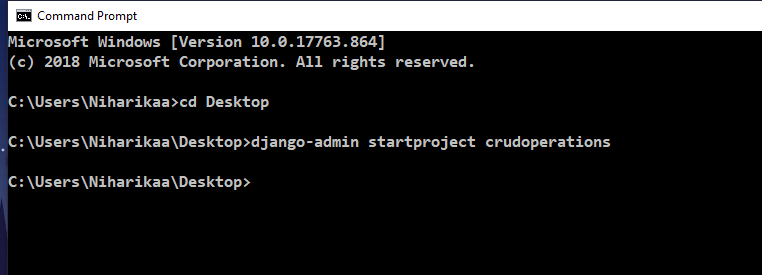

* After the creation of project enter into the directory where manage.py file is present.
* Then for creating the app give the following command in command prompt,
            
                 python manage.py startapp appname
   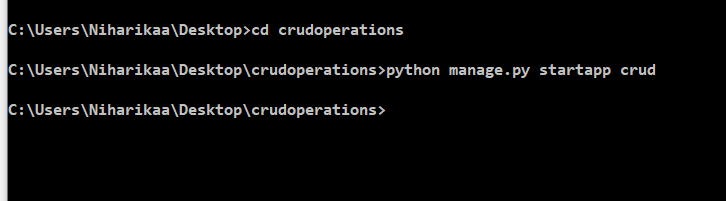
                 
   Now, all the required setups are complete. We can proceed further.
   
### 2. Installing Application and Setting the Database:
* To install the app, just add the application’s name in the INSTALLED_APPS list. This is inside settings.py file.
* To setup the database ,add the following commands in the database section,
              
          DATABASES = {
         'default': {
         'ENGINE': 'django.db.backends.mysql',
            'NAME': 'djangoconnection',
          'USER': 'root',
          'PASSWORD':'',
          'HOST':'',
          'PORT':'',
           }
            }
              
             

### 3. Creation of Model :
* Model is the python file,it is used to create the table in table database as the fields in model.py.
* In model.py we have to assign the table field names along with the data models.
* Syntax:
          
              from django.db import models
              class class_name(models.Model):
                  field1 = models.field1_datamodel(length)
                  field2 = models.field2_datamodel(length)
                  field3 = models.field3_datamodel(length)
                  field4 = models.field4_datamodel(length)
              def __str__(self):
                  return self.field_name
       
  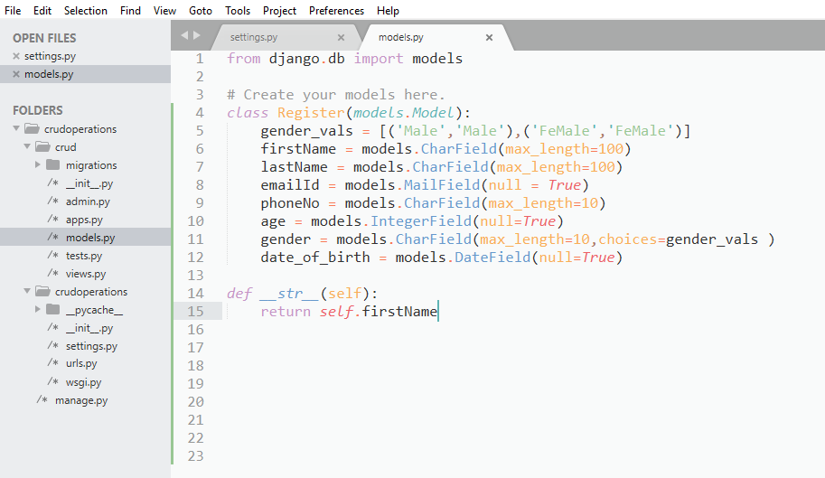
  
 ### 3. Creating the Model Form:
 * Form is a python file.
 * It is a class which is used to create an HTML form by using the Model. It is an efficient way to create a form without writing HTML code.
Django automatically does it for us to reduce the application development time. For example, suppose we have a model containing various fields, we don't need to repeat the fields in the form file.
For this reason, Django provides a helper class which allows us to create a Form class from a Django model.
* Syntax :
            
              from django.forms import ModelForm
              from app_name.models import model_class_name
              class class_name(ModelForm):
	                  class Meta:
		                model = model_class_name
		                fields = '__all__'
                    
 
 ### 4. Registering Model in Django Admin :
* Here we are editing admin.py existing in crud folder. Import the model you want to register in the admin. In this case, it is a Register.
* Syntax :
          
                  admin.site.register(Register)
               
   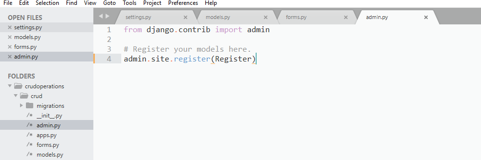

### 5. Making View Functions for Django CRUD App :
* The view functions are our actual CRUD operations in Django.The entire operation will be defined in this views.py.
* The view.py file consists of many functions depending upon our requirement.For our CRUD Operations we use 4 different functions likely for creation,getting the data,editing the stored data,and for deleting the data in database.

		from django.shortcuts import render,redirect
		from django.http import HttpResponse
		from crud.forms import registrationform
		from crud.models import Register
		def register(request):
			if request.method=='POST':
				form = registrationform(request.POST)
				if form.is_valid():
					form.save()
					return redirect('/crud/register')
			form = registrationform()
			return render(request,'crud/register.html',{'form':form})
		

* Till now we are done with the programming part of our CRUD operations.Next steps are to build our html pages for the final outcome in browser.

### 6. Organising the Templates : 
* In this step we will create a folder named templates in the app folder.
* Now in templates folder create another folder with the appname ,in that appname folder we will create all our html files.
* In our CRUD operations we are using register.html,details.html,edit.html and msg.html files.
* So,now we have to create the html files to complete our crud operations.
    ##### 1. Creation of Register.html file:
    * In this register.html we are doing "**create**" CRUD operation.
    * This html page is linked with the data in forms.py.
   
			<!DOCTYPE html>
			<html>
			<head>
				<title>Registration Form</title>
			</head>
			<body>
					<form action="" method="POST">
						
						{{form.as_p}}
					<input type="submit" name="submit" value="Save">
					</form>

			</body>
			</html>
			
     * In views.py we will add the following code to register the data.
     		
		def register(request):
			if request.method=='POST':
				form = registrationform(request.POST)
				if form.is_valid():
					form.save()
					return redirect('/crud/register')
			form = registrationform()
			return render(request,'crud/register.html',{'form':form})
			
    
    ##### 2. Creation of Details.html file :
    * In this Details.html we are doing "**Read/retrive**" CRUD Operation.
    * This html page displays entries in  the table.

				<!DOCTYPE html>
			<html>
			<head>
				<title>Details Page</title>
			</head>
			<body >
				<table border = 0.5>
				
				<tr>
				<td>{{row.firstName}}</td>
				<td><a href="">{{row.lastName}}</a></td>
				<td>{{row.emailId}}</td>
				<td>{{row.Age}}</td>
				<td><a href="">Delete</a></td>
				</tr>

					
				</table>
			</body>
			</html>
	
	* In views.py we will add the following code to view all the entries.
	 
	 	def details(request):
			data = Register.objects.all()
			return render(request,'crud/details.html',{'data':data})

   ##### 3. Creation of Edit.html file :
    * In this Edit.html we are doing "**Edit**" CRUD Operation.
    * This html page Edit the required entry in  the table.

					<!DOCTYPE html>
			<html>
			<head>
				<title>Edit Page</title>
			</head>
			<body>
				<form action="" method="POST">
				
				{{ form.as_p }}
				<button type="submit">update</button>
					</form>
			</body>
			</html>
   * In views.py we will add the following code to edit the data.
			
			def edit(request,id):
			data = Register.objects.get(id=id)
			if request.method =='POST':
				form = registrationform(request.POST,instance=data)
				if form.is_valid():
					form.save()
					return redirect('/crud/details')
			form = registrationform(instance=data)
			return render(request,'crud/edit.html',{'form':form,'data':data})
			
    ##### 4. Creation of Delete.html file:
    * In this Delete.html we are doing "**Delete**" CRUD Operation.
    * This html page deletes the required entry from the table.

			<!DOCTYPE html>
			<html>
			<head>
				<title>Delete page</title>
			</head>
			<body>
				<form action="" method = "POST">
					
					<h2>Are you sure to delete{{info.firstName}}</h2>
					<input type="submit" name="submit"value='Delete'>
					<a href = "">cancel</a>
					</form>
			</body>
			</html>
			
    * In views.py we will add the following code to edit the data.
    				
			def delete(request,id):
				ob = Register.objects.get(id=id)
				if request.method == 'POST':
					ob.delete()
					return redirect('/crud/details')
				return render(request,'crud/msg.html',{'info':ob})

### 7. Adding urls to url path:
* In the main url file we have to include our apps url file .For that we have to add the url.py file path
			
			from django.contrib import admin
			from django.urls import path,include
			urlpatterns = [
			    path('admin/', admin.site.urls),
			    path('crud/',include('crud.urls')),

				]
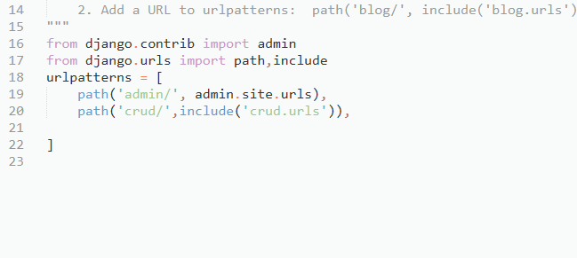
				
* Now in our app we have to create a urls.py file,and in that file we have to add the html files path.
			
			from django.contrib import admin
			from django.urls import path
			from crud import views
			urlpatterns = [
			    path('register/',views.register,name='register'),
				path('details/',views.details,name='details'),
				path('edit/<int:id>',views.edit,name='edit'),
				path('delete/<int:id>',views.delete,name='delete'),

				]
   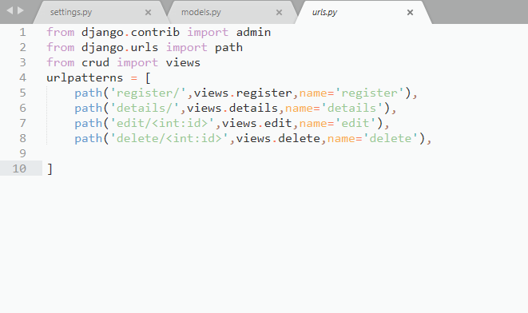

### 8. Migrating the files with Django and running the server :
* Till now we done all the required files and all ,now we have to migrate these files with the django server.for that we have to enter the followng command in command prompt,

                    python manage.py makemigrations
                    python manage.py migrate
		    python manage.py runserver

		    
### 9. Browsing our Websites using localhost :
* After migrating the files,we have check our final outcome.
* For that open the webbrowser and enter the localhost site and the url name.
* syntax:
			
			http://127.0.0.1:8000/appname/urlname/

#### Registration Page:
* url link = http://127.0.0.1:8000/crud/register/
    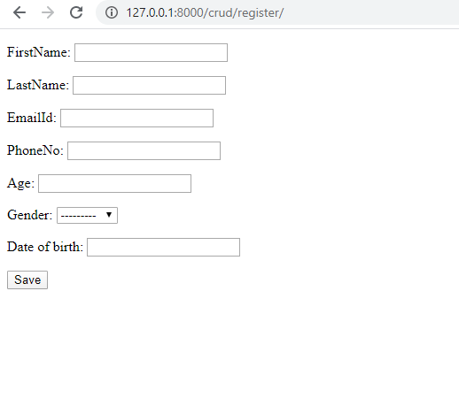

#### Updating Page:
   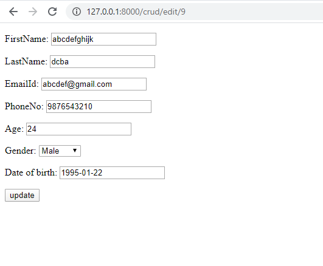

#### Details page :
* url link = http://127.0.0.1:8000/crud/details/
   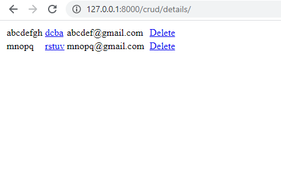

#### Delete page :
* Confirmation page :
   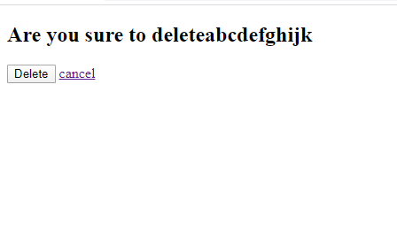

* After Deletion Details page :
   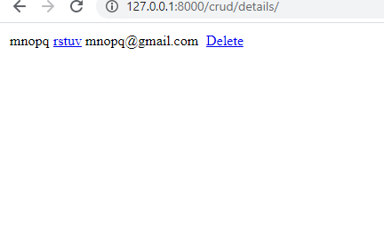
			

		  
          
    

                  
                  

                 

